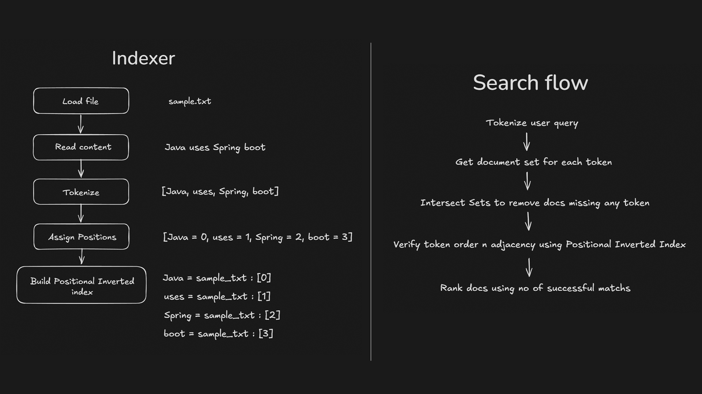
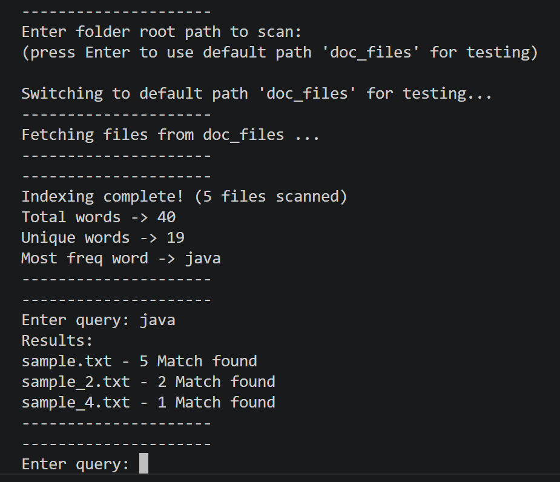

# Doc Surf
Java based document search engine for fast local file indexing and efficient text search
- Extensible architecture with pluggable document extractors for multiple file formats
- Positional inverted index for fast full text and phrase search
- Ranks matching documents by search relevance
- Recursive directory scanning for nested folders

# Overview



# Installation

### Clone the repository

```bash
git clone https://github.com/mns-one/doc-surf.git
cd doc-surf
```

### Build the project

```bash
mvn clean install
```

### Run the application

```bash
mvn spring-boot:run
```

# Usage

1. Run the application

2. Enter Full path of a folder to scan or leave it blank for default folder `doc_files`

3. Enter a search query and get results

-- Supported File Types:

- TXT
- PDF
- DOCX
- Markdown



# Project Structure: `main.java.com.mns.wordfinder`

#### app/
- `App.java` - Startup logic and index building flow

#### model/
- `Document.java` - Stores scanned file data
- `WordData.java` - Stores Indexed data for each word

#### scanner/
- `FileScanner.java` - Recursive directory scanning

#### file/
- `DocumentExtractor.java` - File content Extraction interface
- `ExtractorFactory.java` - Finds compatible Extractor for file

#### parser/
- `Tokenizer.java` - Tokenizes a given String

#### index/
- `InvertedIndex.java` - Builds and stores Positional Inverted Index

#### search/
- `Query.java` - Core search logic

#### doc_files/
- Contains sample files for default startup behaviour